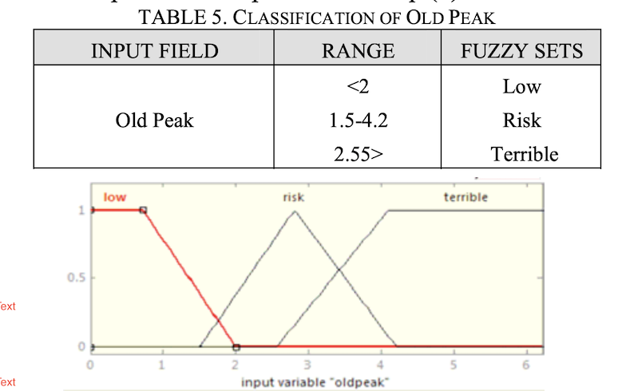
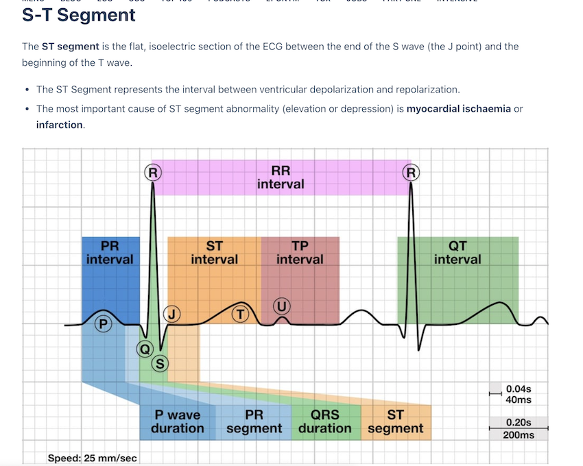
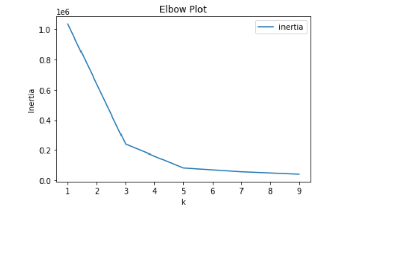
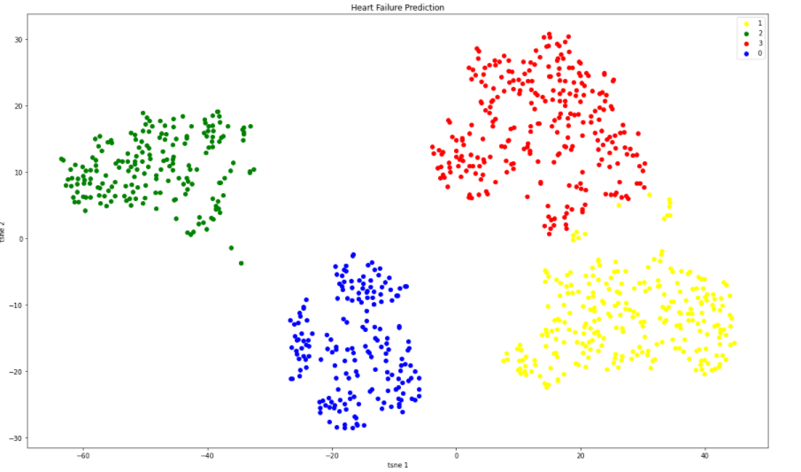
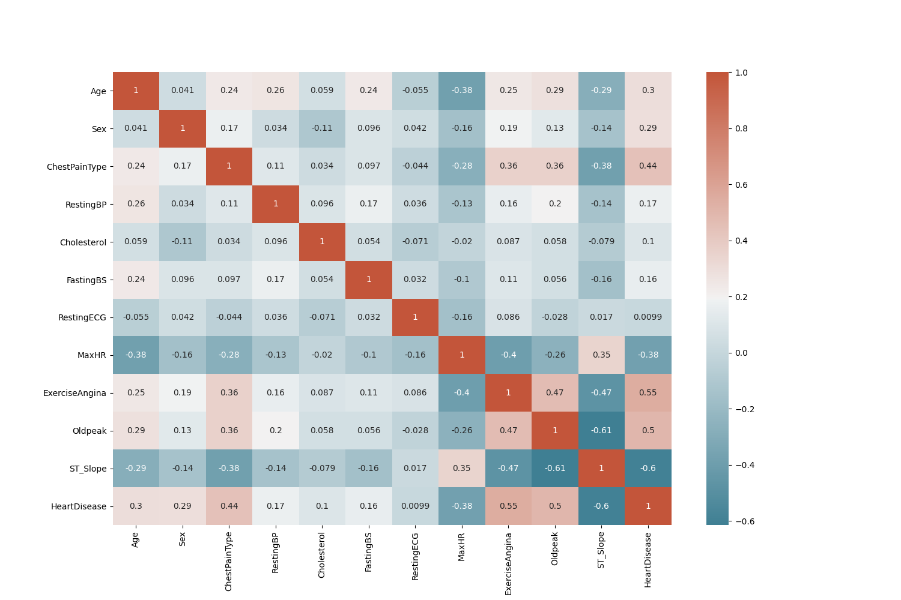

# Final-Project-Heart-Failure-Prediction

​
The task of this project is to analyze dataset containing different characteristics of 918 patients to predict heart failures using Python, Machine Learning and data visualization tools. Utilize the pandas data visualization tools to show the correlation between the variables and find out the factors that are most significant factors in heart failure. Utilize machine learning model to create a model to assess the likelihood of a possible heart disease event
- We made attempt to draw conculsion on basis of target variable.
- We built a model on the target variable.
- We tried to balance our data through scaling.
- We will use accuracy score.

​
**Understanding the terms/characteristics in the dataset**
​
**ChestPainType** - TA: Typical Angina - substernal chest pain precipitated by physical exertion or emotional stress and relieved with rest or nitroglycerin; ATA: Atypical Angina, NAP: Non-Anginal Pain, ASY: Asymptomatic.
ATYPICAL(ATA)=not representative of a type, group, or class.
TYPICAL(TA)= REPRESENTATIVE OF TYPE, GROUP
NAP- Non-cardiac chest pain (NCCP) is a term used to describe chest pain that resembles heart pain (also called angina)
ASY=The resulting shortfall in oxygen-rich blood to your heart muscle can cause the chest discomfort known as angina.
This pain may spread to your shoulders, arms, neck, or jaw. But here's a little-known fact: some of the time,
ischemia causes no symptoms. And this so-called silent ischemia is surprisingly common.

​
**RestingBP** - Blood pressure is a measure of the force that your heart uses to pump blood around your body. Resting blood pressure in mm Hg/ millimeters of mercury. A normal reading would be any blood pressure below 120/80 mm Hg and elevated 120 to 129 mm Hg – systolic< 80 mm Hg – diastolic.

​
**Cholesterol** - Total or serum cholesterol measured in milligrams (mg) of cholesterol per deciliter (dL) of blood. To come up with the serum cholesterol we need to add your HDL and LDL cholesterol levels, plus 20 percent of your triglycerides, to calculate your serum cholesterol levels. Below 200 mg/dL - is desirable/normal; 200-239 mg/dL - borderline high; 240 mg/dL and above - high.

​
**RestingECG** - The normal range of the ECG differed between men and women: heart rate 49 to 100 bpm vs. 55 to 108 bpm, P wave duration 81 to 130 ms vs. 84 to 130 ms, PR interval 119 to 210 ms vs. 120 to 202 ms, QRS duration 74 to 110 ms vs.
What is LVH on an ECG? Left ventricular hypertrophy (LVH), also known as an enlarged heart, is a condition in which the muscle wall of heart's left pumping chamber (ventricle) becomes thickened (hypertrophy). Modified Cornell Criteria: Examine the R wave in aVL. If the R wave is greater than 12 mm in amplitude, LVH is present. Sokolow-Lyon Criteria: Add the S wave in V1 plus the R wave in V5 or V6. If the sum is greater than 35 mm, LVH is present. The ST segment encompasses the region between the end of ventricular depolarization and beginning of ventricular repolarization on the ECG. In other words, it corresponds to the area from the end of the QRS complex to the beginning of the T wave. The ST segment is the interval between the end of the QRS complex (J point, or ST junction) and the beginning of the T wave. In the limb leads, the ST segment is isoelectric in about 75 percent of normal adults. 19. ST segment elevation or depression up to 0.1 mV generally is considered within normal limits. The resting ECG is a simple, quick and painless test. The resting ECG can detect certain heart conditions such as hypertrophy of heart, ischemia, myocardial infarction, sequelae of myocardial infarction, cardiac arrhythmias, etc. The test takes about 5 minutes and no preparation is necessary. 

​
**MaxHR** - Maximum Heart Rate: The increase in the cardiovascular risk, associated with the acceleration of heart rate, was comparable to the increase in risk observed with high blood pressure. An increase in heart rate by 10 beats per minute was associated with an increase in the risk of cardiac death by at least 20%, and this increase in the risk is similar to the one observed with an increase in systolic blood pressure by 10 mm Hg.

​
**Oldpeak** --  This input field means ST depression induced by exercise relative to rest. Old peak field has 3 fuzzy sets (Low, Risk and Terrible). These fuzzy sets have been shown in Table 5 with their ranges. Membership functions of “Low” and “Terrible” fuzzy sets are trapezoidal and membership function of “Risk” fuzzy set is triangular that have been shown.

**ST_slope** -- The ST segment shift relative to exercise-induced increments in heart rate, the ST/heart rate slope (ST/HR slope), has been proposed as a more accurate ECG criterion for diagnosing significant coronary artery disease (CAD).

Morphology of ST Depression
•	ST depression can be either upsloping, downsloping, or horizontal (see diagram below).
•	Horizontal or downsloping ST depression ≥ 0.5 mm at the J-point in ≥ 2 contiguous leads indicates myocardial ischaemia (according to the 2007 Task Force Criteria).
•	ST depression ≥ 1 mm is more specific and conveys a worse prognosis.
•	ST depression ≥ 2 mm in ≥ 3 leads is associated with a high probability of NSTEMI and predicts significant mortality (35% mortality at 30 days).
•	Upsloping ST depression is non-specific for myocardial ischaemia.

**ST-segment changes indicative of obstructive CAD** -- A treadmill ECG stress test is considered abnormal when there is a horizontal or down-sloping ST-segment depression ≥ 1 mm at 60–80 ms after the J point. Exercise ECGs with up-sloping ST-segment depressions are typically reported as an ‘equivocal’ test. In general, the occurrence of horizontal or down-sloping ST-segment depression at a lower workload (calculated in METs) or heart rate indicates a worse prognosis and higher likelihood of multi-vessel disease. The duration of ST-segment depression is also important, as prolonged recovery after peak stress is consistent with a positive treadmill ECG stress test. Another finding that is highly indicative of significant CAD is the occurrence of ST-segment elevation > 1 mm (often suggesting transmural ischaemia); these patients are frequently referred urgently for coronary angiography.

# Process
We utilized various models to compare the scores of each feature. This analysis is trying to find the best model that can detect if a patient will get a heart disease or not. To come up with a solutiom, we used the following models: 
**LogisticRegression**
Logistic regressesion models were built on each variable. The highest scores were obtain in Exercise Angina and Chest pain both in 70% whereas other less correlated features were in 50s and 60s%.
- RandomForestClassifier
- KNN model
- Unsupervised ML - Clustering

​
## Findings and Conclusion
**The logistic regression** will be a better suited model for this dataset, because we are trying to predict whether the heart failure is going to happen or not. In addition, the features/variables in the dataset potentially highly correlated. The Logistic regression performs well on such data. 

-55% of patients had a heart disease.
-Men are almost 2.44 times more likely have a heart disease than women.
-There is weak level correlation between numeric features and the target variable. Oldpeak has a positive correlation with heart disease. -Heart rate/cholesterol have negative correlation with heart disease.
-Exercise-induced angina is a major cause for heart disease. It is 2.5 times more than any other factor.
-Accuracy achieved through above algorithms:- approximate 88% (Logistic Regression and Random Forest). Both Random Forest and Logistic -Regression got similar accuracy scores.

We know that MaxHR is a good indicator that damage to one's heart has occurred due to heart disease.  Using machine model I found that we can predict Heart disease at a 65% rate and this is confirmed when combined with Cholesterol and Resting features increased the prediction to 68%.

As per Old peak range, the persons with heart disease fall under the risk and terrible are male compared to female between age group 40- 60. To learn more about it when performed logistic regression we see. That only 67% of the data fits the model whereas when performed scaling was also returning the same. Similarly, when used random forest it was almost same with 69%. The accuracy  showing 77%
There is one important aspect that shows where people with MaxHR ,Cholesterol and other aspects had impact on their heart but this was shown in ECG where we can see that old peak range is different in each gender. In this dataset, we can see that women of age group more than 55 -70 years are suffering with heart disease with Old peak value reaching to 6.2 max whereas men in their late 40s have their Old peak value reaching to 5.5 max as this clearly shows men are more vulnerable to get heart disease. 

St_slope:
When studied St_slope using ML we see that 82% of the data fits the model irrespective of the scaling or unscaling.In normal type of rest ECG proves to be important for the prediction model along with the down sloping ST slope. The patient composed of these two features usually has cholesterol level between 170 to 225 mg/dl. The other types of slops with the rest ECG seems to be more spread out and less concise.

​
**Unsupervised Learning Model -- Clustering** 
We utilized one of the most famous clustering algorithms – K-Means. We implemented it from scratch and looked at its step-by-step implementation. We also looked at the elbow curve which helps to find the optimum number of clusters in the K-Means algorithm. The K-Elbow Visualizer implements the “elbow” method of selecting the optimal number of clusters for K-means clustering. K-means is a simple unsupervised machine learning algorithm that groups data into a specified number (k) of clusters. The elbow point gives the optimal number of clusters, which is within 3 to 5 here. \

We were able to use PCA and tsne to transform the data and came up with a beautiful cluster that shows that the features could potentially be clustered into 3-5 clusters for further study of heart failure prediction. \

We also ran **correlation analysis** and found that the following variables were highly correlated when we did the correlation on all features: Exercise Angina, Old Peak and Chest Pain. Least correlated features were Maximum Heart and St SLope.\

Tableau links:
https://public.tableau.com/app/profile/ramya6056/viz/Project4_16367238004130/HeartFailurePrediction?publish=yes
https://public.tableau.com/app/profile/harshita.ravi/viz/OLDpeakandSt_slope/Story1?publish=yes
